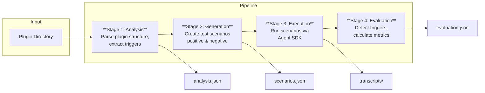

# cc-plugin-eval

[](https://github.com/sjnims/cc-plugin-eval/actions/workflows/ci.yml)
[](https://codecov.io/gh/sjnims/cc-plugin-eval)
[](https://opensource.org/licenses/MIT)
[](https://nodejs.org/)

A 4-stage evaluation framework for testing Claude Code plugin component triggering. Validates whether skills, agents, commands, hooks, and MCP servers correctly activate when expected.

## Why This Exists

Claude Code plugins contain multiple component types (skills, agents, commands) that trigger based on user prompts. Testing these triggers manually is time-consuming and error-prone. This framework automates the entire evaluation process:

- **Discovers** all components in your plugin
- **Generates** test scenarios (positive and negative cases)
- **Executes** scenarios against the Claude Agent SDK
- **Evaluates** whether the correct component triggered

## Features

| Feature                    | Description                                              |
| -------------------------- | -------------------------------------------------------- |
| **4-Stage Pipeline**       | Analysis → Generation → Execution → Evaluation           |
| **Multi-Component**        | Skills, agents, commands, hooks, and MCP servers         |
| **Programmatic Detection** | 100% confidence detection by parsing tool captures       |
| **Semantic Testing**       | Synonym and paraphrase variations to test robustness     |
| **Resume Capability**      | Checkpoint after each stage, resume interrupted runs     |
| **Cost Estimation**        | Token and USD estimates before execution                 |
| **Batch API Support**      | 50% cost savings on large runs via Anthropic Batches API |
| **Multiple Formats**       | JSON, YAML, JUnit XML, TAP output                        |

## Quick Start

### Prerequisites

- Node.js >= 20.0.0
- An Anthropic API key

### Installation

```bash
# Clone the repository
git clone https://github.com/sjnims/cc-plugin-eval.git
cd cc-plugin-eval

# Install dependencies
npm install

# Build
npm run build

# Create .env file with your API key
echo "ANTHROPIC_API_KEY=sk-ant-your-key-here" > .env
```

### Run Your First Evaluation

```bash
# See cost estimate without running (recommended first)
npx cc-plugin-eval run -p ./path/to/your/plugin --dry-run

# Run full evaluation
npx cc-plugin-eval run -p ./path/to/your/plugin
```

## How It Works



### Stage Details

| Stage             | Purpose                                         | Method                                            | Output            |
| ----------------- | ----------------------------------------------- | ------------------------------------------------- | ----------------- |
| **1. Analysis**   | Parse plugin structure, extract trigger phrases | Deterministic parsing                             | `analysis.json`   |
| **2. Generation** | Create test scenarios                           | LLM for skills/agents, deterministic for commands | `scenarios.json`  |
| **3. Execution**  | Run scenarios against Claude Agent SDK          | Tool capture hooks                                | `transcripts/`    |
| **4. Evaluation** | Detect triggers, calculate metrics              | Programmatic first, LLM judge for quality         | `evaluation.json` |

### Scenario Types

Each component generates multiple scenario types to thoroughly test triggering:

| Type          | Description                  | Example                                |
| ------------- | ---------------------------- | -------------------------------------- |
| `direct`      | Exact trigger phrase         | "create a skill"                       |
| `paraphrased` | Same intent, different words | "add a new skill to my plugin"         |
| `edge_case`   | Unusual but valid            | "skill plz"                            |
| `negative`    | Should NOT trigger           | "tell me about database skills"        |
| `semantic`    | Synonym variations           | "generate a skill" vs "create a skill" |

## CLI Reference

### Full Pipeline

```bash
# Run complete evaluation
cc-plugin-eval run -p ./plugin

# With options
cc-plugin-eval run -p ./plugin \
  --config custom-config.yaml \
  --verbose \
  --samples 3
```

### Individual Stages

```bash
# Stage 1: Analysis only
cc-plugin-eval analyze -p ./plugin

# Stages 1-2: Analysis + Generation
cc-plugin-eval generate -p ./plugin

# Stages 1-3: Analysis + Generation + Execution
cc-plugin-eval execute -p ./plugin
```

### Resume & Reporting

```bash
# Resume an interrupted run
cc-plugin-eval resume -r <run-id>

# List previous runs
cc-plugin-eval list -p ./plugin

# Generate report from existing results
cc-plugin-eval report -r <run-id> --output junit-xml
```

### Common Options

| Option                | Description                                       |
| --------------------- | ------------------------------------------------- |
| `-p, --plugin <path>` | Plugin directory path                             |
| `-c, --config <path>` | Config file (default: `config.yaml`)              |
| `--dry-run`           | Generate scenarios without execution              |
| `--estimate`          | Show cost estimate before execution               |
| `--verbose`           | Enable debug output                               |
| `--fast`              | Only run previously failed scenarios              |
| `--no-batch`          | Force synchronous (non-batch) execution           |
| `--rewind`            | Undo file changes after each scenario             |
| `--semantic`          | Enable semantic variation testing                 |
| `--samples <n>`       | Multi-sample judgment count                       |
| `--reps <n>`          | Repetitions per scenario                          |
| `--output <format>`   | Output format: `json`, `yaml`, `junit-xml`, `tap` |

## Programmatic Usage

In addition to the CLI, cc-plugin-eval exports a programmatic API for integration into build systems, test frameworks, and custom tooling.

### Installation

```bash
npm install cc-plugin-eval
```

### Basic Usage

```typescript
import {
  runAnalysis,
  runGeneration,
  runExecution,
  runEvaluation,
  loadConfigWithOverrides,
  consoleProgress,
} from "cc-plugin-eval";
import type {
  EvalConfig,
  AnalysisOutput,
  TestScenario,
} from "cc-plugin-eval/types";

// Load configuration
const config = loadConfigWithOverrides("config.yaml", {
  plugin: "./path/to/plugin",
});

// Stage 1: Analyze plugin structure
const analysis = await runAnalysis(config);

// Stage 2: Generate test scenarios
const generation = await runGeneration(analysis, config);

// Stage 3: Execute scenarios (captures tool interactions)
const execution = await runExecution(
  analysis,
  generation.scenarios,
  config,
  consoleProgress, // or provide custom progress callbacks
);

// Stage 4: Evaluate results
const evaluation = await runEvaluation(
  analysis.plugin_name,
  generation.scenarios,
  execution.results,
  config,
  consoleProgress,
);

console.log(`Accuracy: ${(evaluation.metrics.accuracy * 100).toFixed(1)}%`);
```

### Public API Exports

| Export                    | Description                                              |
| ------------------------- | -------------------------------------------------------- |
| `runAnalysis`             | Stage 1: Parse plugin structure and extract triggers     |
| `runGeneration`           | Stage 2: Generate test scenarios for components          |
| `runExecution`            | Stage 3: Execute scenarios and capture tool interactions |
| `runEvaluation`           | Stage 4: Evaluate results and calculate metrics          |
| `loadConfigWithOverrides` | Load configuration with CLI-style overrides              |
| `consoleProgress`         | Default progress reporter (console output)               |

### Types

Import types via the `cc-plugin-eval/types` subpath:

```typescript
import type {
  EvalConfig,
  AnalysisOutput,
  TestScenario,
  ExecutionResult,
  EvaluationResult,
  EvalMetrics,
} from "cc-plugin-eval/types";
```

## Configuration

Configuration is managed via `config.yaml`. Here's a quick reference:

### Scope (What to Test)

```yaml
scope:
  skills: true # Evaluate skill components
  agents: true # Evaluate agent components
  commands: true # Evaluate command components
  hooks: false # Evaluate hook components
  mcp_servers: false # Evaluate MCP server components
```

### Generation (Stage 2)

```yaml
generation:
  model: "claude-sonnet-4-5-20250929"
  scenarios_per_component: 5 # Test scenarios per component
  diversity: 0.7 # 0.0-1.0, higher = more unique scenarios
  semantic_variations: true # Generate synonym variations
```

### Execution (Stage 3)

```yaml
execution:
  model: "claude-sonnet-4-20250514"
  max_turns: 5 # Conversation turns per scenario
  timeout_ms: 60000 # Timeout per scenario (1 min)
  max_budget_usd: 10.0 # Stop if cost exceeds this
  disallowed_tools: # Safety: block file operations
    - Write
    - Edit
    - Bash
```

### Evaluation (Stage 4)

```yaml
evaluation:
  model: "claude-sonnet-4-5-20250929"
  detection_mode: "programmatic_first" # Or "llm_only"
  num_samples: 1 # Multi-sample judgment
```

See the full [`config.yaml`](./config.yaml) for all options, including:

- **`tuning`**: Fine-tune timeouts, retry behavior, and token estimates
- **`conflict_detection`**: Detect when multiple components trigger for the same prompt
- **`batch_threshold`**: Use Anthropic Batches API for cost savings (50% discount)
- **`sanitization`**: PII redaction with ReDoS-safe custom patterns

## Performance Optimization

### Session Batching (Default)

By default, scenarios testing the same component share a session with `/clear` between them. This reduces subprocess overhead by ~80%:

| Mode              | Overhead per Scenario | 100 Scenarios |
| ----------------- | --------------------- | ------------- |
| Batched (default) | ~1-2s after first     | ~2-3 minutes  |
| Isolated          | ~5-8s each            | ~8-13 minutes |

The `/clear` command resets conversation history between scenarios while reusing the subprocess and loaded plugin.

### When to Use Isolated Mode

Switch to isolated mode when you need complete separation between scenarios:

- Testing plugins that modify filesystem state
- Debugging cross-contamination issues between scenarios
- When using `rewind_file_changes: true` (automatically uses isolated mode)

To use isolated mode:

```yaml
execution:
  session_strategy: "isolated"
```

Or via the deprecated (but still supported) option:

```yaml
execution:
  session_isolation: true
```

## Output Structure

After a run, results are saved to:

```text
results/
└── {plugin-name}/
    └── {run-id}/
        ├── state.json              # Pipeline state (for resume)
        ├── analysis.json           # Stage 1: Parsed components
        ├── scenarios.json          # Stage 2: Generated test cases
        ├── execution-metadata.json # Stage 3: Execution stats
        ├── evaluation.json         # Stage 4: Results & metrics
        └── transcripts/
            └── {scenario-id}.json  # Individual execution transcripts
```

### Sample Evaluation Output

```json
{
  "results": [
    {
      "scenario_id": "skill-create-direct-001",
      "triggered": true,
      "confidence": 100,
      "quality_score": 9.2,
      "detection_source": "programmatic",
      "has_conflict": false
    }
  ],
  "metrics": {
    "total_scenarios": 25,
    "accuracy": 0.92,
    "trigger_rate": 0.88,
    "avg_quality": 8.7,
    "conflict_count": 1
  }
}
```

## Detection Strategy

**Programmatic detection is primary** for maximum accuracy:

1. During execution, tool capture hooks capture all tool invocations
2. Tool captures are parsed to detect `Skill`, `Task`, and `SlashCommand` calls
3. MCP tools detected via pattern: `mcp__<server>__<tool>`
4. Hooks detected via `SDKHookResponseMessage` events
5. Confidence is 100% for programmatic detection

**LLM judge is secondary**, used for:

- Quality assessment (0-10 score)
- Edge cases where programmatic detection is ambiguous
- Multi-sample consensus when configured

## Development

```bash
npm install       # Install dependencies
npm run build     # Build TypeScript
npm test          # Run tests
npm run lint      # Lint code
npm run typecheck # Type check
```

See [CONTRIBUTING.md](CONTRIBUTING.md) for detailed development setup, code style, testing requirements, and pull request guidelines.

## Roadmap

- [x] Phase 1: Skills, agents, commands evaluation
- [x] Phase 2: Hooks evaluation (PR #58)
- [x] Phase 3: MCP servers evaluation (PR #63)
- [ ] Phase 4: Cross-plugin conflict detection
- [ ] Phase 5: Marketplace evaluation

## Security Considerations

### Permission Bypass Mode

**Default: `execution.permission_bypass: true`** enables automated evaluation by automatically approving all tool invocations. This is required for unattended runs but has security implications:

- ✅ Required for CI/CD and automated evaluation
- ⚠️ Plugins can perform any action permitted by allowed tools
- 🔒 Use `disallowed_tools` to restrict dangerous operations (default: `[Write, Edit, Bash]`)
- 🔒 For untrusted plugins, set `permission_bypass: false` for manual review (disables automation)

**Security Note**: With permission bypass enabled, use strict `disallowed_tools` and run in sandboxed environments when evaluating untrusted plugins.

### PII Protection & Compliance

**Default: `output.sanitization.enabled: false`** for backwards compatibility. Enable sanitization for PII-sensitive environments:

```yaml
output:
  sanitize_transcripts: true # Redact saved files
  sanitize_logs: true # Redact console output
  sanitization:
    enabled: true
    custom_patterns: # Optional domain-specific patterns
      - pattern: "INTERNAL-\\w+"
        replacement: "[REDACTED_ID]"
```

**Built-in redaction**: API keys, JWT tokens, emails, phone numbers, SSNs, credit card numbers.

**Enterprise use cases**: Enable when handling PII or complying with GDPR, HIPAA, SOC 2, or similar regulations.

### Default Tool Restrictions

The default `disallowed_tools: [Write, Edit, Bash]` prevents file modifications and shell commands. Modify with caution:

- Enable `Write`/`Edit` only if testing file-modifying plugins
- Enable `Bash` only if testing shell-executing plugins
- Use `rewind_file_changes: true` to restore files after each scenario

### Additional Safeguards

- **API keys**: Loaded from environment variables (`.env`), never stored in config
- **Budget limits**: Set `execution.max_budget_usd` to cap API spending
- **Timeout limits**: Set `execution.timeout_ms` to prevent runaway executions
- **Plugin loading**: Only local plugins supported (`plugin.path`), no remote loading
- **ReDoS protection**: Custom sanitization patterns validated for Regular Expression Denial of Service vulnerabilities

### Enterprise Deployments

For production/enterprise environments with compliance requirements, see the comprehensive security guide in [SECURITY.md](SECURITY.md), including:

- Threat model and risk assessment
- Sandbox and isolation recommendations
- Compliance checklist (GDPR, HIPAA, SOC 2)
- Container isolation patterns

## Contributing

See [CONTRIBUTING.md](CONTRIBUTING.md) for development setup, code style, and pull request guidelines.

This project follows the [Contributor Covenant](CODE_OF_CONDUCT.md) code of conduct.

## License

[MIT](LICENSE)

## Author

Steve Nims ([@sjnims](https://github.com/sjnims))

## Acknowledgements

- [Anthropic](https://www.anthropic.com/) for Claude, the [Anthropic SDK](https://github.com/anthropics/anthropic-sdk-typescript), and the [Claude Agent SDK](https://github.com/anthropics/claude-agent-sdk)
- [Bloom](https://github.com/safety-research/bloom) for architectural inspiration
- [Boris Cherny](https://github.com/bcherny) for [Claude Code](https://github.com/anthropics/claude-code)
- [Zod](https://zod.dev/) for runtime type validation
- [Commander.js](https://github.com/tj/commander.js) for CLI framework
- [Vitest](https://vitest.dev/) for testing
- [Monster Energy](https://www.monsterenergy.com/) for fuel
- [deadmau5](https://deadmau5.com/) for the beats
